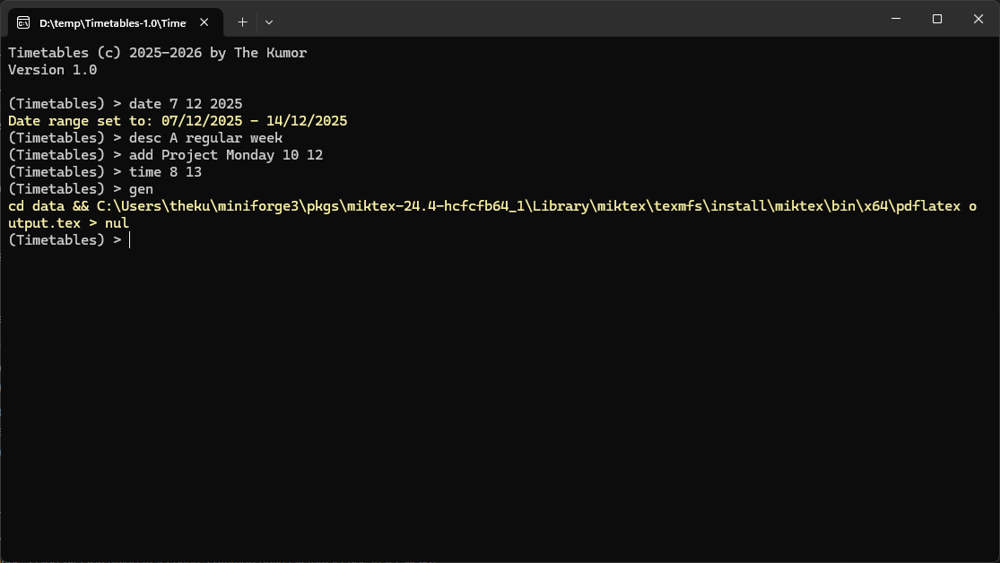
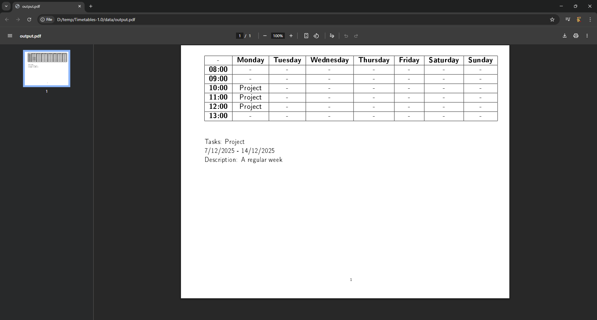

# Timetables
Tool that helps create timetables.

## Background
In today’s fast-paced environment, effective time management has become essential for
productivity and personal well-being. Many individuals and organizations struggle to plan
their daily and weekly activities efficiently, often relying on manual methods such as paper
schedules or scattered digital tools. These approaches can lead to missed deadlines,
overlapping commitments, and increased stress.

## Description
Timetables is a lightweight and efficient program designed to help users create, manage,
and organize their weekly schedules. It provides a simple yet powerful way to plan daily
tasks, classes, work activities, and personal events. By automating timetable creation and
offering clear visual overviews, the program ensures users can manage their time
effectively, avoid scheduling conflicts, and stay productive throughout the week.
Key features include:

- Creating weekly and daily timetables easily.
- Adding, editing, or removing tasks and events.
- Viewing schedules in a clear and organized format.
- Supporting time management for students, professionals, and individuals.
- Simplifying adjustments when plans change.

This project is ideal for anyone looking to stay organized and maintain a schedule without the
hassle of manual planning.

## Target Audience
The program is intended for a wide range of users, including:

- Students, who need to manage class schedules, study time, assignments, and
extracurricular activities.
- Working professionals, who must balance meetings, deadlines, and personal
commitments.
- Small teams or organizations, seeking a simple tool for planning and coordinating
weekly tasks.
- Individuals, looking to improve personal time management and daily productivity.

## Features and Functionalities
Features include:
- Generating .pdf files (gen),
- Commands:
	- echo [text]
	- time [hour] [hourEnd]
	- gen [file=data/output.tex]
	- exit
	- add [task] [weekday] [hour] [hourEnd=hour]
	- rem [weekday] [hour] [hourEnd=hour]
	- date [day] [month] [year]
	- desc [text]
	- erase [task]
	- clear

## Software & Hardware Requirements
Microsoft Windows 10/11. Possible to run on a potato.